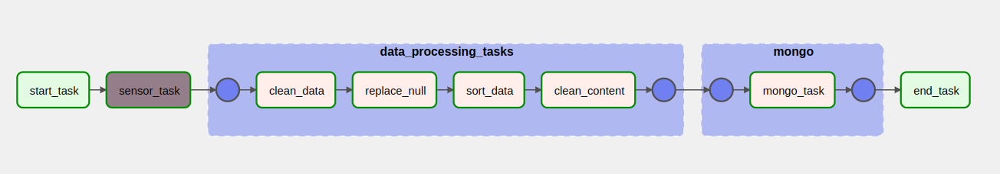

# Task 7. Airflow introduction

## Preparing

Add .env with your environment variables :

```
AIRFLOW_UID=1000
MONGODB_HOST=
MONGODB_PORT=
MONGODB_DATABASE=
MONGODB_USER=
MONGODB_PASSWORD=
```

```bash
docker compose up --build
```

## Dag

[data_processing.py](dags/data_processing.py)



### Description
DAG должен состоять из нескольких задач:

1. Создайте Sensor который будет реагировать на появление нашего файла с данными в папке.

2. После срабатывания Сенсора должны запуститься следующие задачи, которые будут отвечать за обработку данных. Все задачи по обработке данных должны быть объединены в отдельный TaskGroup. Каждая задача должна отвечать за отдельный функционал:

* Очистка данных;

* Заменить все "null" значения на "-";

* Отсортировать данные по created_date;

* Удалите все ненужные символы из content колонки (например, смайлики и т.д.), оставьте только текст и знаки препинания.

3. Последним этапом будет создание задачи по загрузке обработанных данных в MongoDB. Для этого необходимо локально настроить MongoDB и конфигурацию Connections в Airflow.

После того, как вы перенесли все обработанные данные в MongoDB, выполните следующие запросы (непосредственно в MongoDB, например, вкладка Aggregations в MongoDB Compass):

* Топ-5 известных комментариев;

* Все записи, где длина поля “content” составляет менее 5 символов;

* Средний рейтинг по каждому дню (результат должен быть в виде timestamp type).

Результаты запросов: [answers](queries/queries.md).