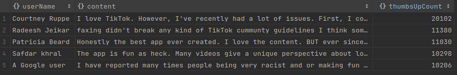
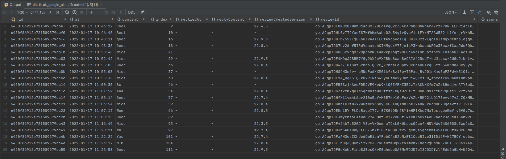
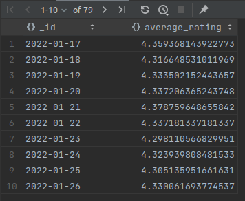

# Queries

## Preparing
Get inside the mongo container to use the console.
```
docker exec -it task7-mongo-1 bash
mongosh -u USERNAME
```
You can also set up a connection to the container using the interface "MongoDB Compass", "DataGrip" and others.

```
use DATABASE_NAME
```

The Datagrid tool was used to display queries.

## Query 1

### Description
Display top 5 famous comments:
```
db.tiktok_google_play_reviews.aggregate([
  { $project: { _id: 0, userName: 1, content: 1, thumbsUpCount: 1 } },
  { $sort: { thumbsUpCount: -1 } },
  { $limit: 5 }
])
```


## Query 2
### Description
Display all records where the length of the "content" field is less than 5 characters.

```
db.tiktok_google_play_reviews.find({ $and: [{ content: { $type: "string" } }, { $expr: { $lt: [{ $strLenCP: "$content" }, 5] } }] })
```


## Query 3
### Description
Display the average rating for each day (the result should be in the form of a timestamp type).

```
db.tiktok_google_play_reviews.aggregate([
  {
    $group: {
      _id: {
        $dateToString: {
          format: "%Y-%m-%d",
          date: {
            $toDate: "$at"
          }
        }
      },
      average_rating: {
        $avg: "$score"
      }
    }
  },
  {
    $sort: {
      _id: 1
    }
  }
])
```

